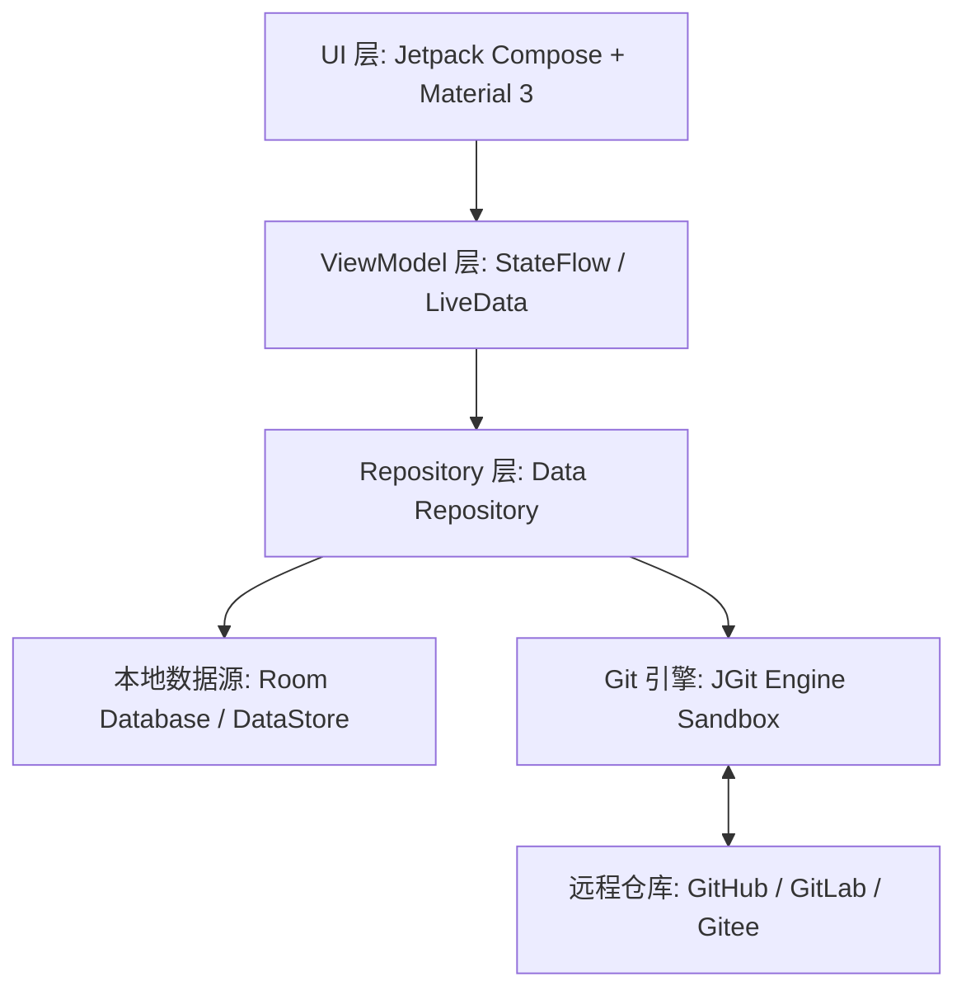

<p align="center">
  
</p>

<h1 align="center">Snippet Studio</h1>

<p align="center">
  <strong>专为开发者与 AI 爱好者打造的高颜值、离线优先 Android 代码片段与 Prompt 工坊</strong>
</p>

<p align="center">
  <a href="https://github.com/echeao/Snippet-Studio-V1/releases"></a>
  <a href="https://developer.android.com/"></a>
  <a href="https://kotlinlang.org/"></a>
  <a href="https://developer.android.com/jetpack/compose"></a>
  <a href="https://www.eclipse.org/jgit/"></a>
  <a href="LICENSE"></a>
</p>

<p align="center">
  <a href="#-核心特性">核心特性</a> •
  <a href="#-应用预览">应用预览</a> •
  <a href="#-技术栈与架构">技术栈</a> •
  <a href="#-快速开始">快速开始</a> •
  <a href="#-配置说明">配置说明</a> •
  <a href="#-路线图">路线图</a>
</p>

---

## 📖 项目简介

**Snippet Studio** 是一款基于 Android 平台构建的现代化代码片段 (Code Snippets) 与 Prompt 提示词管理工具。

在日常开发和 AI 交互中，开发者常需要随时保存、预览和跨设备同步零碎的代码块（HTML/JS/Markdown）或精雕细琢的 AI Prompts。Snippet Studio 将**离线数据安全**与**Git云端同步**完美结合，提供轻量、顺滑且极为优雅的移动端体验。

> 💡 **为什么选择 Snippet Studio？**
> - **无第三方服务绑定**：你的代码存储在你自己的 GitHub/GitLab 私有仓库或本地数据库中。
> - **即时渲染与预览**：HTML/JS 支持实时 Web 渲染预览，Markdown 支持实时富文本渲染。
> - **真正的离线优先**：无网络下依然流畅编辑与离线 Commit，恢复连线后一键 Sync/Push。

---

## ✨ 核心特性

| 模块 | 特性说明 |
| :--- | :--- |
| ⚡ **现代 UI 体验** | 基于 **Jetpack Compose + Material 3** 构建，内置 **5 种主题色盘**（森林绿、海洋蓝、暮光橙、薰衣草紫、极简灰），支持深色/浅色/系统跟随模式与流畅微交互。 |
| 🔄 **原生 Git 云同步** | 内置 **JGit 核心引擎**，支持 PAT 鉴权、Push/Pull 双向同步，具备智能合并冲突检测与自动备份机制。 |
| 📝 **多类型片段与模板** | 原生支持 **HTML**（Web 实时预览）、**JavaScript**（脚本）、**Markdown**（实时富文本渲染）、**Prompt**（AI 提示词），支持开箱即用的模板代码自动注入。 |
| 📂 **SAF 磁盘工作区** | 支持绑定 Android **Storage Access Framework (SAF)** 外部目录或应用私有沙盒，实现跨应用与本地目录灵活管理。 |
| 🏷️ **高效组织与检索** | 支持分类 (Categories)、多标签 (Tags)、星标收藏 (Starred)、全局实时搜索以及带安全恢复功能的**防误删回收站 (Trash)**。 |
| 📦 **数据备份与控制** | 支持通过 SAF 一键**导出 JSON 全量备份文件**，数据完全存储于本地 Room 数据库与你自己的 Git 仓库中。 |
| 🌐 **多语言国际化** | 完整支持 **简体中文 (ZH)**、**English (EN)**、**日本語 (JA)** 自适应切换。 |

---

## 📱 应用预览

> *(滑动或点击查看软件实际运行界面)*

| 🏠 首页概览 | 📝 实时编辑与预览 | ⚙️ Git 同步配置 |
| :---: | :---: | :---: |
|  |  |  |

---

## 🛠️ 技术栈与架构

Snippet Studio 严格遵循 **Android Modern Development (MAD)** 架构标准与 Clean Architecture 规范：



* **Core Language**: Kotlin 2.x (Coroutines, Flow, KSP)
* **UI Framework**: Jetpack Compose, Material 3, Navigation Compose
* **Architecture**: MVVM / Clean Architecture / Single-Activity
* **Local Persistence**: Room Database (ORM), DataStore Preferences
* **Version Control**: Eclipse JGit (Pure Java Git implementation)
* **Build & Config**: Gradle Kotlin DSL, Secrets Gradle Plugin (`.env` 支持)
* **Testing Framework**: JUnit 4, Robolectric, Espresso, Roborazzi 截图对比测试
* **CI/CD**: GitHub Actions (Auto APK Build & Release Workflow)

---

## 📥 快速开始

### 方式 1：下载安装包 (APK)

你可以直接前往 [Releases 页面](https://github.com/echeao/Snippet-Studio-V1/releases) 下载最新版本的 `app-release.apk` 并在 Android 设备上直接安装。

* **最低系统要求**：Android 8.0 (API Level 24) 或更高版本
* **推荐系统版本**：Android 13.0+

### 方式 2：从源码构建

构建项目需要安装 **Android Studio Ladybug (或更高版本)** 以及 **JDK 17+**。

1. **克隆仓库**
   ```bash
   git clone https://github.com/echeao/Snippet-Studio-V1.git
   cd Snippet-Studio-V1
   ```

2. **配置环境变量 (可选)**
   复制 `.env.example` 并重命名为 `.env`：
   ```bash
   cp .env.example .env
   ```

3. **编译并运行**
   使用 Gradle 命令行编译 Debug 包：
   ```bash
   # Windows (PowerShell)
   .\gradlew assembleDebug

   # macOS / Linux
   ./gradlew assembleDebug
   ```

---

## ⚙️ 配置说明

### 🔑 配置 Git 远程仓库同步

1. 打开应用，进入 **设置 (Settings)** 页面 -> 点击 **Git 同步设置**；
2. 填入你的远程 Git 仓库信息：
   - **Repository URL**: 例如 `https://github.com/yourname/my-snippets-repo.git`
   - **Branch**: 例如 `main` 或 `master`
   - **Personal Access Token (PAT)**: 输入具有 `repo` 读写权限的个人访问令牌
3. 点击 **测试连接**。校验成功后即可在主界面及同步中心进行 Pull/Push 双向同步。

### 🎨 外观与偏好自定义

在 **设置** 页面中，你可以根据个人习惯调整：
- **配色风格**：可在 5 种精心设计的调色盘（森林绿、海洋蓝、暮光橙、薰衣草紫、极简灰）中自由切换；
- **深色模式**：开启/关闭深色模式或跟随系统主题；
- **模板注入**：控制新建代码片段时是否自动插入默认代码模版；
- **卡片点击行为**：自定义列表项点击后是“直接进入编辑器”还是“打开详情预览”；
- **数据备份与回收站**：支持导出全量 `.json` 备份文件及彻底清空已删除片段。

---

## 🛣️ 路线图 (Roadmap)

- [x] **v1.0.0 - v1.0.13 核心特性发布**
  - [x] 多类型 Snippet (HTML/JS/Markdown/Prompt) 创建与实时预览
  - [x] Jetpack Compose Material 3 响应式 UI 框架
  - [x] 5 种精美主题色盘（Forest/Ocean/Sunset/Lavender/Mono）及深/浅色模式
  - [x] 基于 JGit 的完整 Commit & Push / Pull 云同步与冲突安全回滚
  - [x] SAF 外部工作区挂载与 JSON 全量备份导出
  - [x] 智能回收站 (Trash) 与片段恢复机制
  - [x] 多语言支持 (ZH / EN / JA)
  - [x] GitHub Actions CI/CD 打包与自动发布流程
- [x] **v1.1.0 演进计划 (已完成)**
  - [x] **AI 动态变量填空**：支持 Prompt `{{变量}}` 占位符解析与快捷填充面板
  - [x] **代码语法高亮**：为编辑区与预览区接入原生轻量级代码语法着色
  - [x] **系统级快捷剪藏**：支持系统分享菜单 (Share Sheet) 一键保存选中代码
  - [x] **单片段 Git 历史履历**：支持查看片段提交 Timeline 与历史版本对比回滚

---

## 🤝 参与贡献

欢迎对 Snippet Studio 提交 Issue 或 Pull Request！

1. Fork 本仓库
2. 创建你的特性分支 (`git checkout -b feature/AmazingFeature`)
3. 提交你的修改 (`git commit -m 'feat: 增加动态代码高亮支持'`)
4. 推送到分支 (`git push origin feature/AmazingFeature`)
5. 发起 Pull Request

> ⚠️ **提交规范**：请确保 Commit Message 使用**简体中文**编写，且代码符合 Kotlin 官方编码规范。

---

## 📄 开源协议

本项目采用 [MIT License](LICENSE) 协议开源，你可以自由使用、修改与分发。

---

<p align="center">
  Made with ❤️ by <a href="https://github.com/echeao">echeao</a> & Antigravity AI
</p>
