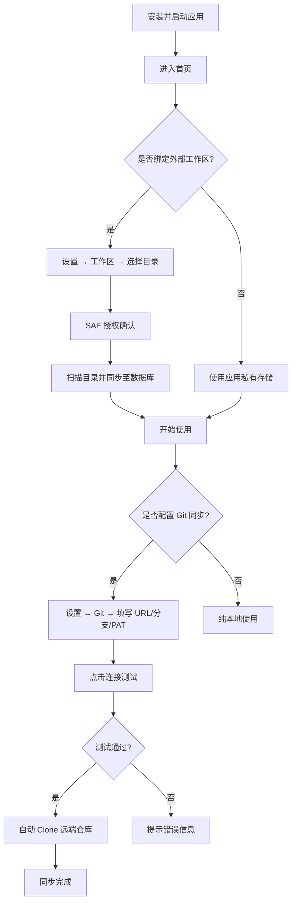
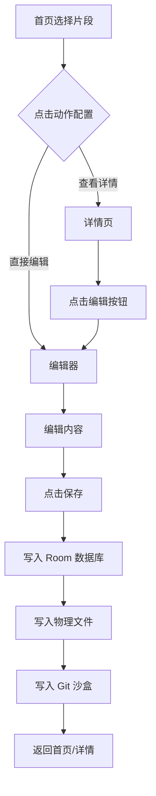
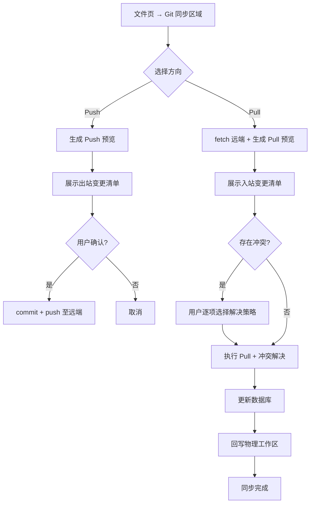

# Snippet Studio V1 — 产品功能规格说明书

| 项目 | 内容 |
|------|------|
| 产品名称 | Snippet Studio |
| 版本 | V1.0 |
| 文档版本 | 1.0 |
| 编写日期 | 2026-07-26 |
| 文档性质 | 产品功能规格说明（面向技术验收） |

---

## 1. 产品概述

### 1.1 产品定位

Snippet Studio 是一款专为开发者与 AI 爱好者打造的**离线优先**Android 代码片段与 Prompt 工坊应用。

### 1.2 目标用户

- 移动端开发者：需要随时查阅/编辑代码片段
- AI 工程师 / Prompt 工程师：管理和迭代 Prompt 模板
- 技术写作者：管理 Markdown 文档片段

### 1.3 核心价值主张

| 价值维度 | 说明 |
|----------|------|
| 离线优先 | 本地 Room 数据库 + 沙盒 JGit 仓，无网络环境下可完整编辑、Commit |
| 数据自主 | 无第三方服务绑定，数据存储于用户私有 Git 仓库或设备本地 |
| 原生 Git 同步 | 支持 PAT 鉴权、双向 Pull/Push、智能冲突检测与自动备份 |
| 多类型支持 | HTML（网页预览）、JavaScript（脚本）、Markdown（富文本渲染）、Prompt（AI 提示词） |
| 高颜值 | 5 种配色风格 × 明暗模式正交组合，Material Design 3 设计语言 |

---

## 2. 运行环境要求

| 项目 | 要求 |
|------|------|
| 操作系统 | Android 11 (API 30) 及以上 |
| 存储权限 | 通过 SAF (Storage Access Framework) 用户授权，无需 `WRITE_EXTERNAL_STORAGE` |
| 网络 | 仅 Git 远程同步（Pull/Push/Clone）时需要；本地编辑完全离线可用 |
| 屏幕 | 建议 5.0 英寸及以上，支持竖屏/横屏 |
| 语言 | 支持简体中文、英文、日语三种界面语言 |

---

## 3. 功能模块清单

### 3.1 片段管理

代码片段是应用的核心数据单元，支持完整的 CRUD 生命周期管理。

| 操作 | 行为描述 |
|------|----------|
| 新建 | 支持 4 种类型（HTML/JS/Markdown/Prompt），可选择是否注入内置样板代码 |
| 编辑 | 全屏代码编辑器，支持语法高亮、行号显示、自动换行、括号配对、Tab 缩进 |
| 重命名 | 修改标题及文件名，自动清理旧文件名在物理存储与 Git 沙盒中的残留 |
| 移动 | 修改片段所属文件夹路径，自动清理旧路径残留 |
| 软删除 | 移入应用内回收站，物理文件移入隐藏 `.trash/` 目录，Git 沙盒同步移除 |
| 恢复 | 从回收站还原至原目录，物理文件从 `.trash/` 恢复，Git 沙盒重新写入 |
| 彻底删除 | 从数据库、`.trash/` 物理目录、Git 沙盒三端永久清除 |
| 过期清理 | 回收站中超过 30 天的片段自动物理清除 |
| 星标收藏 | 一键收藏/取消收藏，支持按星标过滤查看 |
| 标签管理 | 为片段添加/编辑自定义标签，支持全局预设标签 |

### 3.2 多类型支持与预览

| 类型 | 扩展名 | 编辑能力 | 预览能力 |
|------|--------|----------|----------|
| HTML | `.html`, `.htm` | 语法高亮编辑 | WebView 实时渲染预览 |
| JavaScript | `.js`, `.jsx`, `.ts`, `.tsx` | 语法高亮编辑 | WebView 执行预览 |
| Markdown | `.md`, `.markdown` | 语法高亮编辑 | 富文本渲染预览（标题/粗体/列表/代码块） |
| Prompt | `.txt` 及其他 | 纯文本编辑 | 变量占位符高亮 + 变量填充面板 |

**语法高亮支持语言：** HTML, JavaScript, CSS, JSON, Python, Markdown, XML, YAML, Shell, Prompt

**Prompt 变量功能：**
- 自动识别 `{{variable}}` 格式的占位符
- 提供变量填充面板，用户可逐项填入实际值
- 填充后一键复制完整 Prompt 到剪贴板

### 3.3 文件夹层级管理

| 操作 | 行为描述 |
|------|----------|
| 创建文件夹 | 支持多层级路径（如 `frontend/components`），同步在物理存储创建目录 |
| 树形浏览 | 文件页按文件夹层级展示，支持展开/折叠 |
| 分组显示 | 首页/列表页按文件夹分组展示片段 |
| 空文件夹保留 | 文件夹作为独立实体存入数据库，即使无片段也保留目录结构 |
| 外部目录同步 | 物理文件系统中的文件夹变更（新增/删除）自动同步至数据库 |

### 3.4 工作区绑定

| 模式 | 说明 |
|------|------|
| SAF 外部目录 | 用户通过系统文件选择器授权任意目录（如 `Download/snippets`），应用通过 DocumentFile API 读写 |
| 私有目录降级 | 未绑定外部目录时，自动降级使用应用私有存储 `getExternalFilesDir/snippets` |
| 双向同步 | 应用内操作实时写入物理文件；外部文件变更在应用回到前台时自动扫描同步至数据库 |
| 反向清理 | 物理文件被外部删除时，对应数据库记录自动移入回收站 |

### 3.5 Git 版本同步

| 功能 | 行为描述 |
|------|----------|
| 连接配置 | 设置远程仓库 URL、分支名、PAT (Personal Access Token) |
| 连接测试 | 一键验证远程仓库可达性与 PAT 有效性 |
| 克隆/初始化 | 首次连接自动 Clone 远端仓库至应用沙盒；无远端时本地 Init |
| Pull 预览 | Dry Run 模式：fetch 远端最新，生成变更清单（新增/更新/删除/冲突），零数据修改 |
| Pull 执行 | 用户确认预览后执行拉取，冲突按用户选择解决，三端（DB+物理+沙盒）同步更新 |
| Push 预览 | 导出 DB 至沙盒后通过 git status 检测未提交变更，生成出站变更清单 |
| Push 执行 | 用户确认后 commit + push 至远端，自动生成结构化提交信息 |
| 冲突解决 | 支持三种策略：保留本地 / 保留远端 / 两者都保留（远端版本重命名） |
| 历史查看 | 查看仓库级与文件级 Git 提交历史，支持查看任意历史版本内容与行级 Diff |
| 远端删除透传 | Pull 时远端已删除的文件，同步从本地物理目录和数据库中精准清除 |

### 3.6 搜索与过滤

| 功能 | 说明 |
|------|------|
| 关键词搜索 | 按标题、文件名、内容全文模糊匹配 |
| 类型过滤 | 按 HTML / JS / Markdown / Prompt 分类筛选 |
| 星标过滤 | 仅显示已收藏片段 |
| 排序 | 按最后修改时间降序排列（默认） |
| 视图切换 | 网格视图（卡片）/ 列表视图（紧凑行）自由切换 |

### 3.7 系统分享剪藏

| 功能 | 说明 |
|------|------|
| 文本接收 | 接收系统 `ACTION_SEND` 的 `EXTRA_TEXT`，自动检测类型（HTML/JS/Markdown/Prompt） |
| 文件接收 | 接收 `EXTRA_STREAM` 的 content URI，解析文件内容（支持 2MB 以内文本文件） |
| 静默模式 | 设置为"静默"时，接收后直接保存并 Toast 提示，无需用户交互 |
| 面板模式 | 设置为"面板"时，弹出快速编辑面板，允许修改标题和类型后确认保存 |

### 3.8 主题与个性化

**配色风格（5 种）：**

| 风格 ID | 名称 | 色调描述 |
|---------|------|----------|
| `forest` | 森林绿 | 自然清新绿色系（默认） |
| `ocean` | 海洋蓝 | 沉稳专业蓝色系 |
| `sunset` | 暮光橙 | 温暖活力橙色系 |
| `lavender` | 薰衣草紫 | 优雅柔和紫色系 |
| `mono` | 极简灰 | 纯粹无彩灰色系 |

**明暗模式（3 种）：** 跟随系统 / 强制浅色 / 强制深色

配色风格与明暗模式**正交组合**，共 5 × 2 = 10 种视觉呈现。

**编辑器配置项：**

| 配置 | 说明 | 默认值 |
|------|------|--------|
| 字号 | 编辑器文本大小 | 13.5sp |
| 自动换行 | 超出屏幕宽度时软换行 | 开启 |
| 行号显示 | 左侧行号栏 | 开启 |
| 当前行高亮 | 光标所在行背景高亮 | 开启 |
| Tab 缩进 | Tab 键空格数 | 4 |
| 括号配对 | 输入左括号自动补全右括号 | 开启 |
| 样板代码 | 新建时注入类型模板 | 开启 |

### 3.9 多语言支持

| 语言 | 资源目录 |
|------|----------|
| 简体中文（默认） | `values-zh-rCN/` |
| 英文 | `values-en/` |
| 日语 | `values-ja/` |

语言切换即时生效，无需重启应用。

### 3.10 数据导入导出

| 格式 | 说明 |
|------|------|
| JSON 导出 | 全量片段序列化为格式化 JSON 文件（含元数据：app 名称、版本、导出时间、数量） |
| ZIP 备份 | 生成含 `manifest.json`（元数据清单）+ `snippets/`（独立源文件）的压缩归档包 |

---

## 4. 用户操作流程图

### 4.1 首次使用流程

### 4.2 日常编辑流程

### 4.3 Git 同步流程

---

## 5. 已知限制与约束

| 编号 | 限制项 | 说明 |
|------|--------|------|
| L-01 | 单文件大小上限 | 通过文件分享导入时，超过 2MB 的文件将被跳过 |
| L-02 | 支持的文件扩展名 | html, htm, js, jsx, ts, tsx, md, markdown, txt, text, json, xml, css, csv |
| L-03 | Git 沙盒延迟对齐 | 外部文件变更在应用回到前台时同步至 DB，Git 沙盒在下次 Push 时自动对齐 |
| L-04 | 单仓库限制 | 当前版本仅支持绑定一个 Git 远程仓库 |
| L-05 | 二进制文件 | 不支持图片、PDF 等二进制文件的管理与预览 |
| L-06 | 隐藏文件过滤 | 以 `.` 开头的文件和目录（如 `.trash/`、`.git/`）不参与同步扫描 |
| L-07 | 并发编辑 | 不支持多设备同时编辑同一片段的实时协同（通过 Git 冲突机制事后解决） |
| L-08 | 网络协议 | Git 远程同步仅支持 HTTPS 协议（不支持 SSH） |

---

## 6. 页面导航结构

| 页面 | 路由 | 功能 |
|------|------|------|
| 首页 | `home` | 片段列表、分类过滤、搜索、快捷新建 |
| 文件页 | `files` | 文件夹树形浏览、Git 同步操作入口 |
| 设置页 | `settings` | 语言/主题/编辑器/Git/工作区配置 |
| 编辑器 | `editor/{id}` | 全屏代码编辑、语法高亮、实时预览 |
| 详情页 | `detail/{id}` | 片段只读查看、渲染预览、快捷操作 |
| 子页面 | `sub/{key}` | Git 配置、关于页等二级设置 |
| 历史页 | `history/{id}` | Git 提交历史时间线、版本 Diff 查看 |

---

*文档结束*
