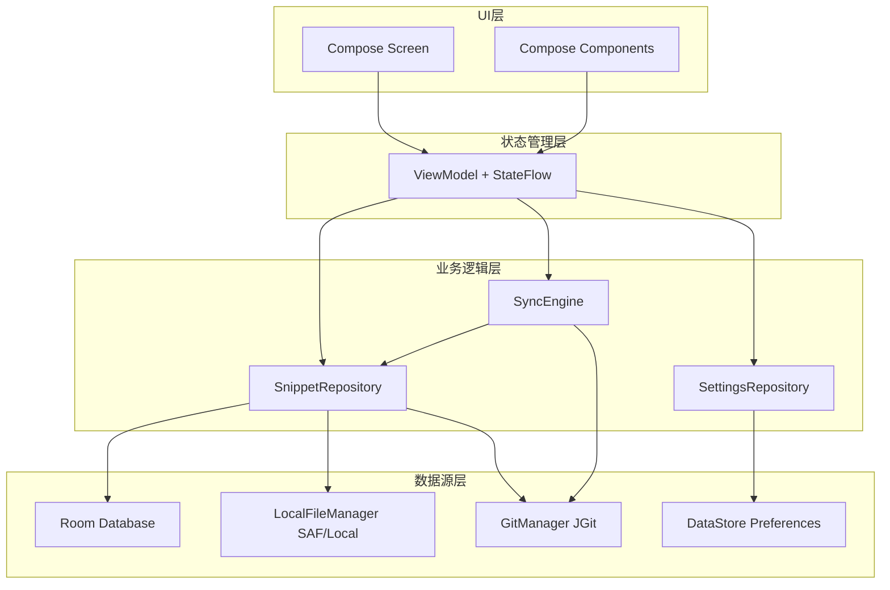
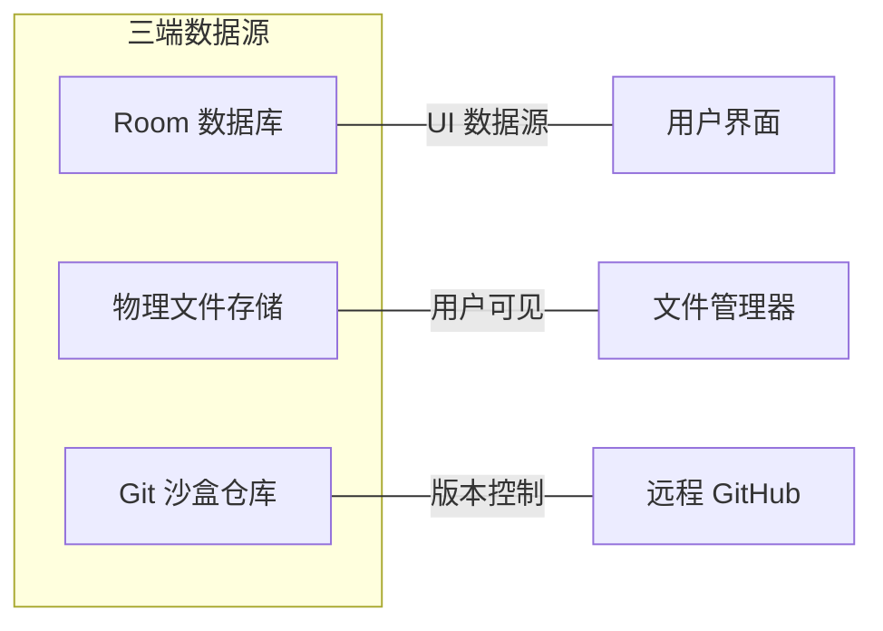
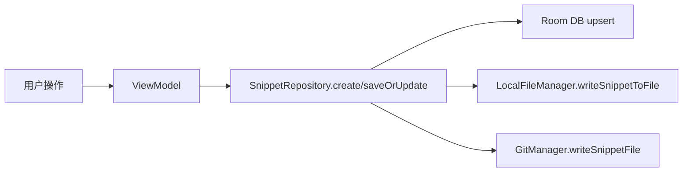
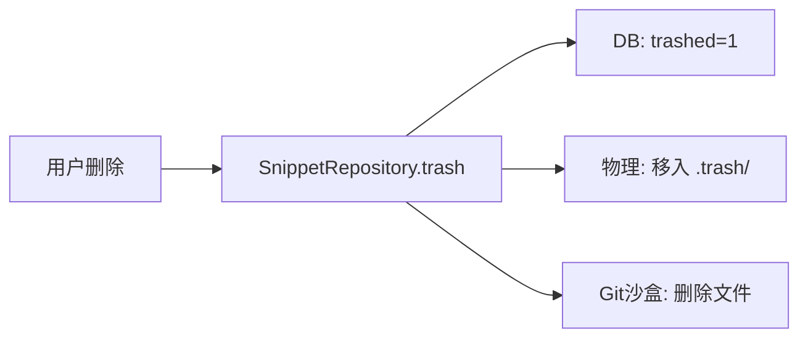
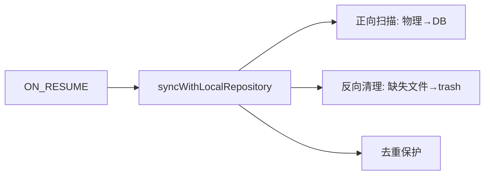
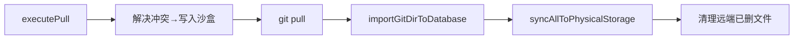
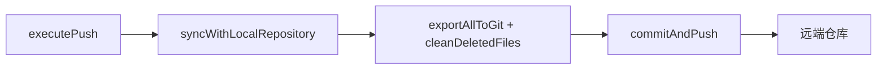
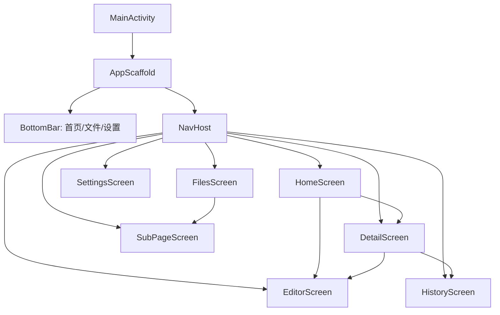
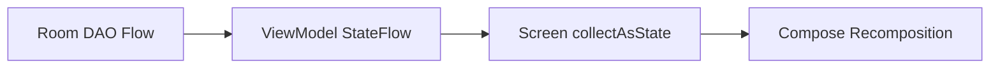
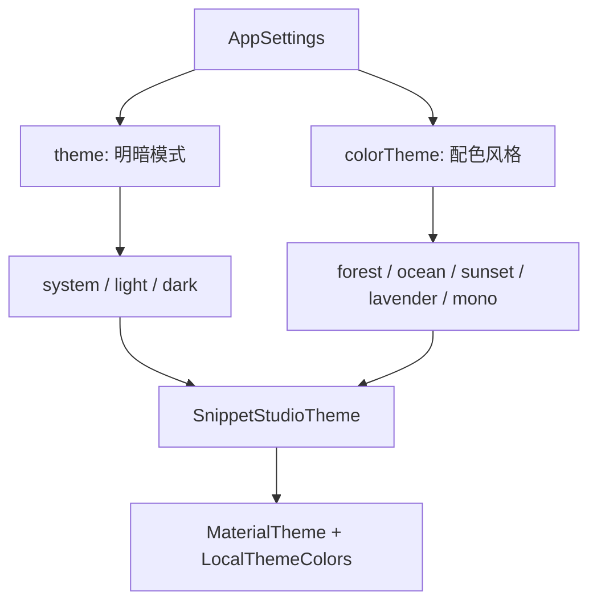

# Snippet Studio V1 — 系统架构设计文档

| 项目 | 内容 |
|------|------|
| 产品名称 | Snippet Studio |
| 版本 | V1.0 |
| 文档版本 | 1.0 |
| 编写日期 | 2026-07-26 |
| 文档性质 | 系统架构设计说明（面向技术验收） |

---

## 1. 架构总览

### 1.1 分层架构

应用采用经典的四层分离架构，各层职责明确、依赖方向单一（上层依赖下层）：



### 1.2 架构设计原则

| 原则 | 实践 |
|------|------|
| 单一职责 | 每个类仅承担一个明确职责（如 GitManager 只管 Git 操作，LocalFileManager 只管物理文件） |
| 依赖倒置 | UI 层不直接依赖数据源，通过 Repository 和 ViewModel 解耦 |
| 响应式数据流 | 使用 Kotlin Flow + StateFlow 驱动 UI 自动更新，避免手动刷新 |
| 离线优先 | 所有操作先落盘本地（Room + 文件），网络同步为可选增强 |
| 最终一致性 | 三端数据允许短暂不一致，通过触发时机保障最终对齐 |

---

## 2. 技术选型与依据

| 技术 | 版本 | 选型理由 |
|------|------|----------|
| Kotlin | 2.x | Android 官方首选语言，协程支持优秀 |
| Jetpack Compose | BOM 2024+ | 声明式 UI，开发效率高，Google 官方推荐 |
| Room | 2.6+ | 编译期 SQL 校验，Flow 响应式查询，ORM 映射 |
| JGit | 6.x | 纯 Java Git 实现，无需设备预装 git 命令行 |
| SAF (DocumentFile) | AndroidX | Android 11+ Scoped Storage 合规方案 |
| DataStore Preferences | 1.x | 替代 SharedPreferences，异步非阻塞，协程友好 |
| Navigation Compose | 2.x | 单 Activity 架构路由管理 |
| 手动 DI (AppContainer) | - | 轻量级依赖注入，避免 Hilt/Dagger 编译开销 |

### 2.1 关键技术决策说明

**为何选择 JGit 而非命令行 git？**
- Android 设备不保证预装 git 二进制文件
- JGit 为纯 Java 实现，可打包进 APK，无外部依赖
- 支持在应用沙盒内独立运行完整 Git 工作流

**为何选择 SAF 而非直接文件路径访问？**
- Android 11 (API 30) 起强制 Scoped Storage，应用无法直接访问外部存储任意路径
- SAF 通过用户显式授权获取持久化 Tree URI，合规且安全
- 提供私有目录降级方案，确保无授权时应用仍可正常工作

**为何选择手动 DI 而非 Hilt？**
- 项目依赖图简单（单 Activity + 少量单例），无需注解处理器
- 减少编译时间和 APK 体积
- `by lazy` 惰性单例天然线程安全

---

## 3. 三端同步架构

### 3.1 三端定义



| 端 | 物理位置 | 职责 |
|----|----------|------|
| Room 数据库 | `databases/snippet_studio.db` | UI 唯一数据源，存储元数据与内容 |
| 物理文件存储 | SAF 授权目录 或 `getExternalFilesDir/snippets` | 用户可通过文件管理器直接访问的实体文件 |
| Git 沙盒仓库 | `files/git_snippets_repo` | 应用内部私有 Git 工作树，用于版本控制与远端同步 |

### 3.2 一致性策略：最终一致性 + 延迟自修复

三端数据**不要求实时强一致**，而是通过以下触发时机保障最终对齐：

| 触发时机 | 同步方向 | 覆盖端 |
|----------|----------|--------|
| 应用内操作（新建/编辑/删除） | DB → 物理 + Git 沙盒 | 三端实时 |
| 应用回到前台 (ON_RESUME) | 物理 → DB（含反向清理） | DB + 物理 |
| Push 预览/执行前 | 物理 → DB → Git 沙盒 | 三端全量对齐 |
| Pull 执行后 | Git 沙盒 → DB → 物理 | 三端全量回写 |

**延迟自修复机制：** 当外部删除文件后，ON_RESUME 将 DB 记录标记为 trashed，但 Git 沙盒中残留文件。下次 Push 时 `exportAllToGit()` 内部的 `cleanDeletedFiles()` 会以 DB 活动记录为准，自动删除沙盒中多余文件，使 git status 正确反映 DELETED 状态。

### 3.3 核心同步链路

#### 链路 1：应用内新建/编辑



#### 链路 2：应用内软删除



#### 链路 3：外部文件变更感知



#### 链路 4：Git Pull



#### 链路 5：Git Push



---

## 4. Git 同步协议设计

### 4.1 Dry Run 预览机制

**设计原则：** 所有同步操作在执行前必须生成变更预览，预览阶段**零数据修改**，确保用户知情且可撤销。

| 预览类型 | 实现方式 | 数据来源 |
|----------|----------|----------|
| Pull 预览 | `git fetch`（不修改工作树）→ 对比远端/沙盒/DB 三方差异 | `getRemoteFileContents` vs `getSandboxFileContents` vs `allActiveSnapshot` |
| Push 预览 | 导出 DB → 沙盒 → `git add .` → 读取 `git status` | `getUncommittedChanges` |

### 4.2 冲突检测与解决策略

**冲突判定条件：** 远端文件内容与沙盒不同，且本地 DB 内容与沙盒也不同（即双方都修改了同一文件）。

| 解决策略 | 行为 |
|----------|------|
| KEEP_LOCAL | 以本地 DB 内容为准写入沙盒 |
| KEEP_REMOTE | 以远端内容为准写入沙盒 |
| KEEP_BOTH | 保留本地版本，远端版本以 `{name}_remote.{ext}` 重命名保存 |

**冲突备份保护：** 若 Pull 过程中发生 JGit MergeStatus.CONFLICTING，自动将冲突文件备份为 `conflict_{timestamp}_{filename}`，随后 `reset --hard` 恢复干净状态。

### 4.3 远端删除透传机制

Pull 执行时：
1. 记录 Pull 前沙盒文件列表 `beforeSandboxFiles`
2. 执行 `git pull`
3. 记录 Pull 后沙盒文件列表 `afterSandboxFiles`
4. 计算差集 `remoteDeletedPaths = before - after`
5. 对差集中的每个路径：删除物理文件 + 从 DB 中 purge 记录

### 4.4 全空仓熔断保护

**问题场景：** 全新安装应用 → 首次 Clone 远端仓库 → 此时 DB 为空 → 若触发 `cleanDeletedFiles`，会将刚 Clone 的文件全部误删。

**熔断策略：** 仅当 DB 中存在已知记录（活动片段 > 0 或回收站不为空）时，才允许执行 `cleanDeletedFiles` 镜像清理。

---

## 5. 软删除与回收站设计

### 5.1 设计方案

采用**隐藏回收站目录**方案：

```
workspace/
├── snippet_a.html        ← 正常活动文件
├── utils/
│   └── helper.js
└── .trash/               ← 隐藏回收站（同步逻辑自动跳过）
    └── deleted_file.md
```

### 5.2 设计优势

| 优势 | 说明 |
|------|------|
| 主目录干净 | 用户通过文件管理器看不到已删除文件 |
| 零同步侵入 | 同步逻辑天然跳过 `.` 开头的目录，无需额外过滤代码 |
| 可恢复 | 物理文件未真正删除，支持应用内一键恢复 |
| 原子操作 | 删除/恢复均为文件移动操作，不涉及内容拷贝 |

### 5.3 过期自动清理

回收站中停放超过 30 天（可配置）的片段，在应用启动时自动执行物理清除（从 `.trash/` 删除文件 + 从 DB 中 purge 记录）。

---

## 6. 导航与页面架构

### 6.1 单 Activity 架构

应用采用 Android 推荐的 Single-Activity Architecture：
- 唯一入口：`MainActivity`
- 页面切换：Jetpack Navigation Compose 路由
- 全屏沉浸：Edge-to-Edge 布局 + 系统栏适配

### 6.2 路由图



### 6.3 状态管理模式

每个页面配备独立 ViewModel，通过 `StateFlow` 暴露 UI 状态：



---

## 7. 主题系统设计

### 7.1 正交组合模型



### 7.2 注入机制

| 层级 | 组件 | 职责 |
|------|------|------|
| 注册表 | `ColorThemeRegistry` | 管理 5 种配色方案的 Light/Dark 双色板定义 |
| 入口函数 | `SnippetStudioTheme` | 接收 `themeSetting` + `colorThemeId` 双参数，组装 MaterialTheme |
| 语义色注入 | `LocalThemeColors` | CompositionLocal 向 UI 层注入动态语义色（bg/surface/text/line） |
| 类型图标色 | `TypeIconPalette` | 每种配色主题下 4 种语言图标拥有协调的前景色 |

### 7.3 色板结构

每个配色主题包含：
- 品牌主色 × 3（primary / primary2 / primarySoft）
- 浅色模式 7 色（bg / surface / surface2 / text / text2 / text3 / line）
- 深色模式 7 色（同上）
- 语言类型图标色 × 4（html / js / md / prompt）

---

## 8. 安全与权限设计

| 方面 | 设计 |
|------|------|
| 存储访问 | 通过 SAF 用户显式授权，无需危险权限申请 |
| PAT 存储 | 存入 DataStore Preferences（应用沙盒内），不写入日志或导出 |
| 网络安全 | Git 远程通信走 HTTPS + PAT 鉴权 |
| 数据隔离 | Git 沙盒位于应用私有 `filesDir`，外部不可访问 |
| 文件过滤 | 同步时自动跳过二进制文件（扩展名白名单）和超大文件（2MB 上限） |

---

*文档结束*
